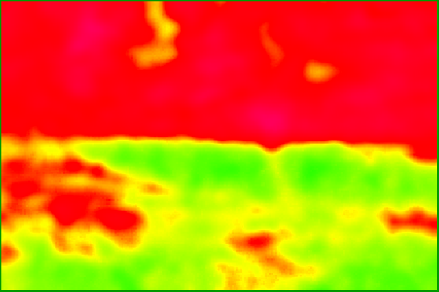

= {Title}
:title:     pngpetite
:author:    Urs Roesch
:firstname: Urs
:lastname:  Roesch
:email:     github@bun.ch
:revnumber: 0.2
:keywords:  PNG, size reduction, image processing, shrink, crush, web images
:toc:       left
:icons:     font

A script to reduce the size of PNG images significantly. The code is based on
https://github.com/chrissimpkins/Crunch[Crush] by Christopher Simpkins and has
been adapted to Linux by refactoring it. As the code base shows significant
differences the name has also been changed.

[[pngpetite]]
== pngpetite

[[pngpetite-prerequisites]]
=== Prerequisites
* bc
* https://pngquant.org/[pngquant]
* https://github.com/google/zopfli[zopflipng]

[[pngpetite-usage]]
=== Usage

----
Usage:
  pngpetite <options> <png-image> ...

Options:
  -h | --help         This message
  -r | --replace      Replace file with processed one
                      Implies -d
  -d | --dest <path>  Place images in given path
                      Implies -r
  -S | --no-stats     Don't print stats
  -q | --quiet        Don't print stats and progress
----

[[pngpetite-examples]]
=== Examples

.Default usage. Yields `happy-sun-pngpetite.png`
----
pngpetit happy-sun.png
Original (KB)   Stage1 (KB)    Final (KB)    Saved (KB)       Saved %    Time (sec)  Image Name
------------- ------------- ------------- ------------- ------------- -------------  -------------
       25.639        16.186        13.857        11.781        45.951        22.204  happy-sun.png
----

.Replace existing image. Yields `happy-sun.png`
----
pngpetit --replace happy-sun.png
Original (KB)   Stage1 (KB)    Final (KB)    Saved (KB)       Saved %    Time (sec)  Image Name
------------- ------------- ------------- ------------- ------------- -------------  -------------
       25.639        16.186        13.857        11.781        45.951        22.204  happy-sun.png
----

.Place processed image in new directory. Yields `pngpetite/happy-sun.png`
----
pngpetit --dest pngpetite happy-sun.png
Original (KB)   Stage1 (KB)    Final (KB)    Saved (KB)       Saved %    Time (sec)  Image Name
------------- ------------- ------------- ------------- ------------- -------------  -------------
       25.639        16.186        13.857        11.781        45.951        22.204  happy-sun.png
----

.Process all PNG images in directory `originals` and place them in directory `pngpetite`.
----
pngpetite --dest pngpetite original/*png
Original (KB)   Stage1 (KB)    Final (KB)    Saved (KB)       Saved %    Time (sec)  Image Name
------------- ------------- ------------- ------------- ------------- -------------  -------------
      695.867       695.867       658.104        37.764         5.427        20.190  original/beach.png
       25.639        16.186        13.857        11.781        45.951        22.197  original/happy-sun.png
       54.101        29.885        27.244        26.856        49.642         8.097  original/shinkansen-n700.png
----

<<<

[[visual-examples]]
== Visual Examples

`pngpetite` is not suited for every type of picture. Especially photographic images may not yield high savings.
To visualize the differences between the original image and the optimzed one,
google's https://github.com/google/butteraugli[`butteraugli`] tools is used.

[[visual-examples-photographs]]
=== Photographs

[[visual-examples-photographs-beach]]
==== Beach Sunset

.Processing Results
[options = "header"]
|===
| Original (KB) | Stage1 (KB) |  Final (KB) |  Saved (KB) | Saved % | Butteraugli Score
|       443.642 |     443.642 |     432.071 |      11.570 |   2.608 |          0.000000
|===

Noticeable is that at stage 1 `pngquant` could not find any potential for optimization.
At stage 2 `zopflipng` was able to squeeze at least a couple of bytes using a better compression algorithm.
Comparing the two images with `butteraugli` shows the images are identical with a score of 0 and a completely
green heatmap.

For images with many details and no large continuous area the savings are miniscule.

===== Original
image::samples/original/beach.png[Beach sunset original]
===== Optimized
image::samples/pngpetite/beach.png[Beach sunset optimized by pngpetite 2.608% smaller]
===== Heatmap

[[visual-examples-photographs-cat]]
==== Grey Cat

.Processing Results
[options = "header"]
|===
| Original (KB) | Stage1 (KB) |  Final (KB) |  Saved (KB) | Saved % | Butteraugli Score
|       567.165 |     203.444 |     191.070 |     376.095 |  66.311 |          3.771626
|===

The heatmap shows clearly where the biggest differences occur during the processing.
Notable are they eyes and the background. The fur is very similar to the orignial image.

===== Original
image::samples/original/cat.png[Grey cat original]
===== Optimized
image::samples/pngpetite/cat.png[Grey cat optimized by pngpetite 66.311% smaller]
===== Heatmap
image::samples/heatmap/cat.png[Grey cat heatmap - differences expecially in the eye region]

<<<

[[visual-examples-illustrations]]
=== Illustrations

[[visual-examples-illustrations-sun]]
==== Happy Sun

.Processing Results
[options = "header"]
|===
| Original (KB) | Stage1 (KB) |  Final (KB) |  Saved (KB) | Saved % | Butteraugli Score
|        30.321 |      17.008 |      15.390 |      14.932 |  49.245 |          0.252952
|===

The images are nearly similar the butteraugli heatmap does not have any red in it just
a few areas in the face of the sun.

===== Original
image::samples/original/happy-sun.png[Happy sun original]
===== Optimized

===== Heatmap
image::samples/heatmap/happy-sun.png[Happy sun heatmap - differences arround the face]

[[visual-examples-illustrations-shinkansen]]
==== Shinkansen N700

.Processing Results
[options = "header"]
|===
| Original (KB) | Stage1 (KB) |  Final (KB) |  Saved (KB) | Saved % | Butteraugli Score
|        52.336 |      23.198 |      21.682 |      30.654 |  58.572 |          1.596476
|===

Large savings with a few diffrences in the under carriages as the heatmap shows.

===== Original
image::samples/original/shinkansen-n700.png[Shinkansen N700 original]
===== Optimized
image::samples/pngpetite/shinkansen-n700.png[Shinkansen N700 optimized by pngpetite 49.245% smaller]
===== Heatmap
image::samples/heatmap/shinkansen-n700.png[Shinkansen N700 heatmap - differences in the undercarriage]

<<<

[[attribution]]
== Attribution

[[attribution-images]]
=== Images
beach.png:: CC0 Public Domain https://pixabay.com/en/beach-north-sea-sea-sunset-water-2179624/[pixabay.com]
cat.png:: CC0 Public Domain https://pixabay.com/en/cat-animal-cat-s-eyes-eyes-pet-1285634/[pixabay.com]
happy-sun.png:: CC0 Public Domain https://openclipart.org/detail/193427/happy-stick-figure-sun[opencliapart.org]
shinkansen-n700.png:: CC0 Public Domain https://openclipart.org/detail/164521/shinkansen-n700-frontview[opencliapart.org]
