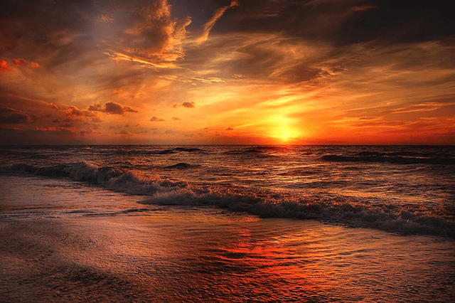
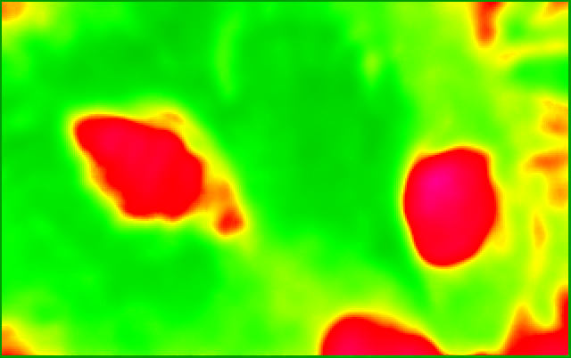
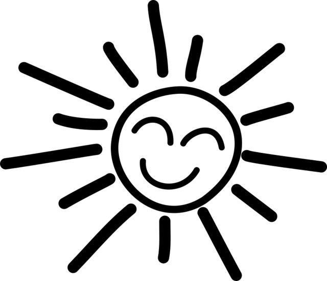
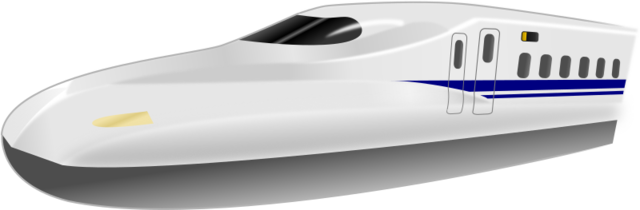
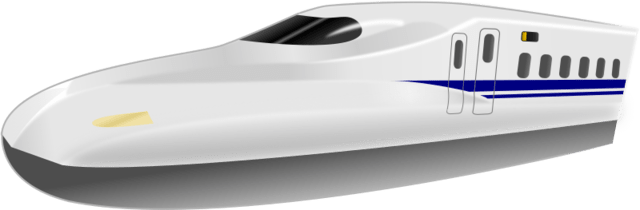
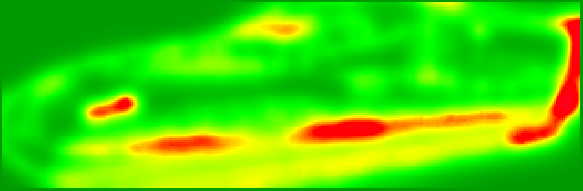

# pngpetite

A script to reduce the size of PNG images significantly. The code is based on
[Crush](https://github.com/chrissimpkins/Crunch) by Christopher Simpkins and has
been adapted to Linux by refactoring it. As the code base shows significant
differences the name has also been changed.

## Prerequisites

  - bc

  - file

  - [pngquant](https://pngquant.org/)

  - [zopflipng](https://github.com/google/zopfli)

  - [butteraugli](https://github.com/google/butteraugli) (optional)

## Usage

``` shell
Usage:
  pngpetite <options> <png-image> ...

Options:
  -h | --help         This message
  -r | --replace      Replace file with processed one
                      Implies -d
  -d | --dest <path>  Place images in given path
                      Implies -r
  -S | --no-stats     Don't print stats
  -q | --quiet        Don't print stats and progress
  -V | --version      Print version and exit

Description:
  Insane(ly slow but wicked good) PNG image optimization
  Built with pngquant and zopflipng optimizers
```

## Examples

**Default usage. Yields `happy-sun-pngpetite.png`.**

    pngpetit happy-sun.png
    Original (KB)   Stage1 (KB)    Final (KB)    Saved (KB)       Saved %    Time (sec)  Image Name
    ------------- ------------- ------------- ------------- ------------- -------------  -------------
           25.639        16.186        13.857        11.781        45.951        22.204  happy-sun.png

**Replace existing image. Yields `happy-sun.png`.**

    pngpetit --replace happy-sun.png
    Original (KB)   Stage1 (KB)    Final (KB)    Saved (KB)       Saved %    Time (sec)  Image Name
    ------------- ------------- ------------- ------------- ------------- -------------  -------------
           25.639        16.186        13.857        11.781        45.951        22.204  happy-sun.png

**Place processed image in new directory. Yields `pngpetite/happy-sun.png`.**

    pngpetit --dest pngpetite happy-sun.png
    Original (KB)   Stage1 (KB)    Final (KB)    Saved (KB)       Saved %    Time (sec)  Image Name
    ------------- ------------- ------------- ------------- ------------- -------------  -------------
           25.639        16.186        13.857        11.781        45.951        22.204  happy-sun.png

**Process all PNG images in directory `originals` and place them in directory `pngpetite`..**

    pngpetite --dest pngpetite original/*png
    Original (KB)   Stage1 (KB)    Final (KB)    Saved (KB)       Saved %    Time (sec)  Image Name
    ------------- ------------- ------------- ------------- ------------- -------------  -------------
          695.867       695.867       658.104        37.764         5.427        20.190  original/beach.png
           25.639        16.186        13.857        11.781        45.951        22.197  original/happy-sun.png
           54.101        29.885        27.244        26.856        49.642         8.097  original/shinkansen-n700.png

## Docker usage

``` shell
docker run \
  --rm \
  --tty \
  --volume "$(pwd)":"$(pwd)" \
  --workdir "$(pwd)" \
  --user "$(id -u):$(id -g)" \
  uroesch/pngpetite <PNG image> [<PNG image> ...]
```

Or simply use the `docker-pngpetite` wrapper script found in the `bin`
directory.

``` shell
bin/docker-pngpetite <PNG image> [<PNG image> ...]
```

## Visual Examples

`pngpetite` is not suited for every type of picture. Especially photographic images
may not yield high savings.
To visualize the differences between the original image and the optimized one,
google’s [`butteraugli`](https://github.com/google/butteraugli) tools is used.

<div class="note">

The values presented below were done on an Ubuntu 20.10 machine with:  
`pngquant 2.12.0 (January 2018)`  
`zopfli 1.0.3`  
Your milage may vary.

</div>

### Photographs

#### Beach Sunset

| Original (KB) | Stage1 (KB) | Final (KB) | Saved (KB) | Saved % | Butteraugli Score |
| ------------- | ----------- | ---------- | ---------- | ------- | ----------------- |
| 443.642       | 164.648     | 150.155    | 293.486    | 66.154  | 2.676426          |

Processing Results

Noticeable is that at stage 1 `pngquant` shrinks the image by 62% in older versions
photographic pictures did only yield a reduction in size.
At stage 2 `zopflipng` is able to squeeze another 4% from its compression algorithm.
Comparing the two images with `butteraugli` shows a large differences especially in
the sunset section of the image.

##### Original


##### Optimized



##### Heatmap


#### Grey Cat

| Original (KB) | Stage1 (KB) | Final (KB) | Saved (KB) | Saved % | Butteraugli Score |
| ------------- | ----------- | ---------- | ---------- | ------- | ----------------- |
| 567.165       | 204.628     | 192.016    | 375.149    | 66.145  | 3.551921          |

Processing Results

The heatmap shows clearly where the biggest differences occur during the processing.
Notable are they eyes and the background. The fur is very similar to the originial image.

##### Original


##### Optimized


##### Heatmap



### Illustrations

#### Happy Sun

| Original (KB) | Stage1 (KB) | Final (KB) | Saved (KB) | Saved % | Butteraugli Score |
| ------------- | ----------- | ---------- | ---------- | ------- | ----------------- |
| 30.321        | 17.326      | 15.683     | 14.639     | 48.279  | 0.309227          |

Processing Results

The images are nearly similar the butteraugli heatmap does not have any red in it just
a few areas in the face of the sun.

##### Original



##### Optimized


##### Heatmap


#### Shinkansen N700

| Original (KB) | Stage1 (KB) | Final (KB) | Saved (KB) | Saved % | Butteraugli Score |
| ------------- | ----------- | ---------- | ---------- | ------- | ----------------- |
| 52.336        | 24.226      | 22.686     | 29.650     | 56.654  | 1.674651          |

Processing Results

Large savings with a few differences in the under carriages as the heatmap shows.

##### Original



##### Optimized



##### Heatmap



## Known issues

  - Under Docker the time statistics are not yet working correctly

## Attribution

### Images

  - beach.png  
    CC0 Public Domain [pixabay.com](https://pixabay.com/en/beach-north-sea-sea-sunset-water-2179624/)

  - cat.png  
    CC0 Public Domain [pixabay.com](https://pixabay.com/en/cat-animal-cat-s-eyes-eyes-pet-1285634/)

  - happy-sun.png  
    CC0 Public Domain [opencliapart.org](https://openclipart.org/detail/193427/happy-stick-figure-sun)

  - shinkansen-n700.png  
    CC0 Public Domain [opencliapart.org](https://openclipart.org/detail/164521/shinkansen-n700-frontview)
